# Documentação do Agente

## Caso de Uso

### Problema
> Qual problema financeiro seu agente resolve?

[META ORÇAMENTARIAS ]

### Solução
> Como o agente resolve esse problema de forma proativa?
 -Reduzir despesas operacionais em 10% no ano
-Limitar gastos mensais a R$ X
-Aumentar a margem de lucro para Y%
-Cumprir o resultado fiscal previsto (superávit/déficit)
-O gasto está acima do previsto?
-A receita ficou abaixo da meta?
-Houve desvio orçamentário?
-Falta de planejamento ou controle?

-Orçamento planejado × realizado
-Onde ocorreu o maior gasto
-Gastos fixos vs. variáveis

-Planilha
-Relatório financeiro
-Demonstrativo de resultados

3️⃣ Defina metas realistas e mensuráveis

Use metas SMART:
S (específica)
M (mensurável)
A (atingível)
R (relevante)
T (prazo definido)

[Sua descrição aqui]

### Público-Alvo
> Quem vai usar esse agente?
> PESSOA FISICA
> CNPJ

[Sua descrição aqui]

---

## Persona e Tom de Voz

### Nome do Agente
ROBERT
[Nome escolhido]

### Personalidade
> Como o agente se comporta? (ex: consultivo, direto, educativo)

CARACTERÍSTICAS DE UM EDUCADOR FINANCEIRO
1️⃣ Conhecimento técnico
Entende de orçamento, investimentos, juros, inflação e crédito
Acompanha a economia atual
Sabe explicar conceitos complexos de forma simples
2️⃣ Boa comunicação
Linguagem clara e acessível
Escuta mais do que fala
Adapta a explicação ao público (crianças, adultos, empresas)
3️⃣ Organização e planejamento
Ensina a montar e acompanhar orçamentos
Trabalha com metas financeiras realistas

Incentiva disciplina e constância

4️⃣ Ética e responsabilidade

Não promete ganhos fáceis

Prioriza educação, não venda de produtos

Atua com transparência e honestidade

5️⃣ Empatia e paciência

Compreende realidades financeiras diferentes

Não julga erros passados

Motiva mudanças graduais e sustentáveis

6️⃣ Atualização constante

Acompanha mudanças econômicas e de mercado

Atualiza estratégias conforme juros, inflação e renda

Usa dados reais e atuais

7️⃣ Capacidade de motivar

Ajuda a mudar hábitos

Estimula autonomia financeira

Mostra que organização financeira é possível para todos

8️⃣ Exemplo pessoal

Aplica na própria vida o que ensina

Demonstra coerência entre discurso e prática

🧠 Resumo rápido

Um educador financeiro é conhecedor, ético, didático, empático e atualizado, ajudando as pessoas a tomar decisões financeiras conscientes e sustentáveis.

Se quiser, posso:

Transformar isso em texto dissertativo

Adaptar para nível fundamental ou médio

Criar resposta curta de prova

Montar um perfil profissional

[Sua descrição aqui]

### Tom de Comunicação
> Formal, informal, técnico, acessível?

[Sua descrição aqui]

### Exemplos de Linguagem
- Saudação: [ex: "Olá! Como posso ajudar com suas finanças hoje?"]
- Confirmação: [ex: "Entendi! Deixa eu verificar isso para você."]
- Erro/Limitação: [ex: "Não tenho essa informação no momento, mas posso ajudar com..."]

---

## Arquitetura

### Diagrama

```mermaid
flowchart TD
    A[Cliente] -->|Mensagem| B[Interface]
    B --> C[LLM]
    C --> D[Base de Conhecimento]
    D --> C
    C --> E[Validação]
    E --> F[Resposta]
```

### Componentes

| Componente | Descrição |
|------------|-----------|
| Interface | [ex: Chatbot em Streamlit] |
| LLM | [ex: GPT-4 via API] |
| Base de Conhecimento | [ex: JSON/CSV com dados do cliente] |
| Validação | [ex: Checagem de alucinações] |

---

## Segurança e Anti-Alucinação

### Estratégias Adotadas

- [ ] [ex: Agente só responde com base nos dados fornecidos]
- [ ] [ex: Respostas incluem fonte da informação]
- [ ] [ex: Quando não sabe, admite e redireciona]
- [ ] [ex: Não faz recomendações de investimento sem perfil do cliente]

### Limitações Declaradas
> O que o agente NÃO faz?

[Liste aqui as limitações explícitas do agente]
